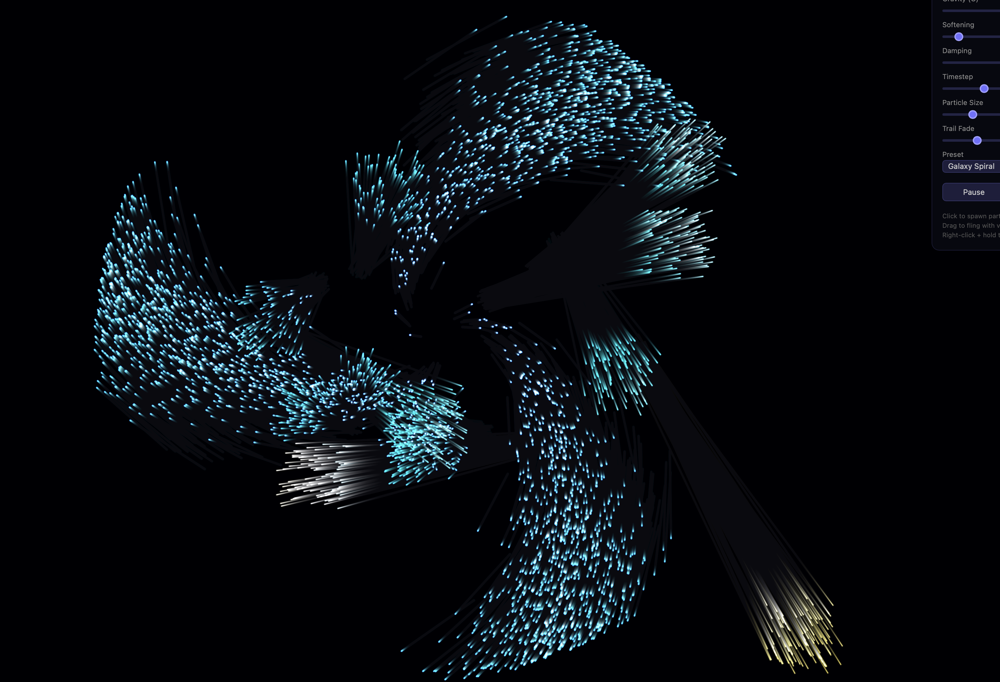

# N-Body Gravity Simulation

A real-time N-body gravity simulation running entirely on the GPU via WebGPU compute shaders. Thousands of particles interact gravitationally, forming galaxies, clusters, and orbital structures.

**[Try it live](https://victorantos.github.io/GravitySimulation/)**



## Features

- GPU-accelerated N-body physics via WebGPU compute shaders
- Shared memory tiling optimization (O(N²) force calculation, bandwidth-efficient)
- Interactive — click to spawn particles, drag to fling, right-click to attract
- Three presets: Galaxy Spiral, Random Cloud Collapse, Two Colliding Galaxies
- Real-time parameter tuning: gravity, softening, damping, timestep
- Additive blending with glow and velocity-based coloring
- Particle trail effect with adjustable fade

## Getting Started

Serve the directory with any static file server and open in Chrome or Edge:

```bash
python3 -m http.server 8080
```

Then visit `http://localhost:8080`.

> **Note:** Requires a browser with WebGPU support (Chrome 113+, Edge 113+, Safari 18+).

## Controls

| Action | Input |
|--------|-------|
| Spawn particles | Click |
| Fling particles | Click + drag |
| Gravitational attractor | Right-click + hold |

**Sliders:** Gravity (G), Softening, Damping, Timestep, Particle Size, Trail Fade

**Presets:** Galaxy Spiral, Random Cloud, Two Galaxies

## How It Works

The simulation uses the classic **shared memory tiling** pattern — the same algorithm used in NVIDIA's CUDA N-Body sample:

1. Particles are split into tiles of 256
2. Each workgroup cooperatively loads a tile into fast shared memory
3. Every thread computes gravitational forces against the tile
4. Repeat for all tiles — reduces global memory reads by 256×

This maps directly to CUDA concepts:

| WebGPU (WGSL) | CUDA |
|----------------|------|
| `@workgroup_size(256)` | `<<<blocks, 256>>>` |
| `var<workgroup>` | `__shared__` |
| `workgroupBarrier()` | `__syncthreads()` |
| `global_invocation_id.x` | `blockIdx.x * blockDim.x + threadIdx.x` |

## GPU Programming Glossary

Key GPU concepts used in this project, explained for newcomers:

**Thread** — A single unit of execution on the GPU. Each thread processes one particle. Unlike CPU threads, GPU threads are extremely lightweight — a GPU runs thousands simultaneously.

**Workgroup (CUDA: Thread Block)** — A group of threads that execute together and can share fast local memory. In this project, each workgroup is 256 threads. Threads within a workgroup can cooperate; threads in different workgroups cannot.

**Dispatch (CUDA: Kernel Launch)** — Telling the GPU to run a compute shader across many workgroups. `dispatchWorkgroups(16)` launches 16 workgroups = 4,096 threads.

**Shared Memory (CUDA: `__shared__`)** — Fast on-chip memory accessible to all threads in a workgroup. ~100x faster than global memory. In `nbody.wgsl`, `var<workgroup> tile` is shared memory — each workgroup loads 256 particles here so every thread can read them cheaply.

**Barrier (CUDA: `__syncthreads()`)** — Forces all threads in a workgroup to wait until everyone reaches the same point. Essential when threads write to shared memory and then read each other's results. Every thread must hit the barrier — no early returns allowed.

**Global Memory** — The GPU's main memory (VRAM). Large but slow. Storage buffers (`var<storage>`) live here. The tiling optimization reduces how often threads read from global memory.

**Double Buffering** — Using two buffers and swapping them each frame. The compute shader reads from buffer A and writes to buffer B, then next frame reads B and writes A. Prevents threads from reading data that another thread is simultaneously overwriting.

**Bind Group** — How you connect GPU buffers to shader variables. Like plugging cables into a shader — "binding 0 is the particle buffer, binding 1 is the uniform buffer." Swapping bind groups each frame is how double buffering works.

**Uniform Buffer** — A small, read-only buffer for values that are the same for every thread (gravity constant, timestep, particle count). Equivalent to CUDA kernel arguments or `__constant__` memory.

**Instanced Rendering** — Drawing the same geometry (a quad) thousands of times, once per particle. Each instance reads its position from the particle buffer using `instance_index`. One draw call renders all 4,096+ particles.

**Additive Blending** — Instead of new pixels replacing old ones, their colors are added together. Overlapping particles create brighter regions, giving the natural glow effect of dense star clusters.

**Softening Factor** — A small value (epsilon²) added to distance calculations to prevent infinite forces when two particles are very close. Standard technique in astrophysical N-body simulations. Without it, particles that get too close explode to infinity.

## Porting to CUDA

This project is designed to port almost line-for-line to CUDA. Here's what it would take:

### What changes

| Component | WebGPU | CUDA |
|-----------|--------|------|
| Language | WGSL (`.wgsl` files) | CUDA C++ (`.cu` files) |
| GPU setup | `requestAdapter()` / `requestDevice()` | `cudaSetDevice()` |
| Memory allocation | `device.createBuffer()` | `cudaMalloc()` |
| Upload data | `device.queue.writeBuffer()` | `cudaMemcpy(HostToDevice)` |
| Run compute | `pass.dispatchWorkgroups(n)` | `kernel<<<n, 256>>>()` |
| Shared memory | `var<workgroup> tile: array<Particle, 256>` | `__shared__ Particle tile[256]` |
| Synchronize | `workgroupBarrier()` | `__syncthreads()` |
| Thread ID | `global_invocation_id.x` | `blockIdx.x * blockDim.x + threadIdx.x` |
| Rendering | WebGPU render pipeline | OpenGL/Vulkan interop or separate renderer |

### Steps to port

1. **Translate `nbody.wgsl` to a CUDA kernel** — The compute shader maps almost directly. Replace WGSL syntax with CUDA C++, `var<workgroup>` with `__shared__`, and `workgroupBarrier()` with `__syncthreads()`. The tiling algorithm is identical.

2. **Replace buffer management** — Swap `device.createBuffer()` for `cudaMalloc()`, and `queue.writeBuffer()` for `cudaMemcpy()`. Double buffering becomes a simple pointer swap (`std::swap(d_in, d_out)`).

3. **Choose a rendering approach** — Options:
   - **CUDA-OpenGL interop**: Map a GL buffer as a CUDA resource, write particle positions from the kernel, render with OpenGL. This is what NVIDIA's `nbody` sample does.
   - **Separate renderer**: Copy particle data back to the CPU each frame and render with any graphics API. Simpler but slower.
   - **Vulkan compute + render**: Skip CUDA entirely and use Vulkan compute shaders — the closest equivalent to what this project already does with WebGPU.

4. **Build system** — You'll need the CUDA Toolkit (`nvcc` compiler) and a Makefile or CMake project. NVIDIA's CUDA samples repo provides good templates.

### Reference

NVIDIA's official CUDA N-Body sample uses the exact same shared memory tiling algorithm: [CUDA Samples — nbody](https://github.com/NVIDIA/cuda-samples/tree/master/Samples/5_Domain_Specific/nbody)

## Tests

Run the test suite with Node.js (no dependencies required):

```bash
npm test
```

Or directly:

```bash
node --test tests/*.test.js
```

37 tests covering initial conditions (galaxy spiral, random cloud, two galaxies), uniform buffer encoding, double buffer alternation, workgroup dispatch, and spawn clamping.

## Author

**Victor Antofica** — [victorantos.com](https://victorantos.com)

## License

This project is licensed under the GNU General Public License v3.0 — see the [LICENSE](LICENSE) file for details.
